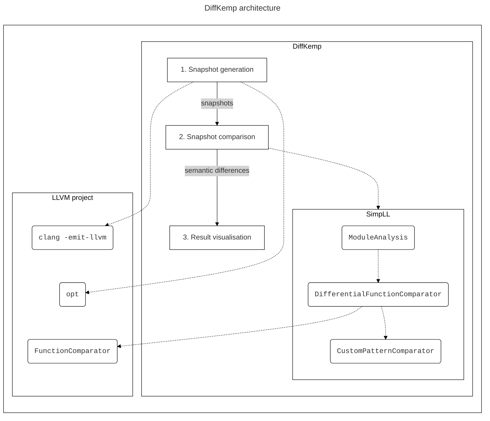
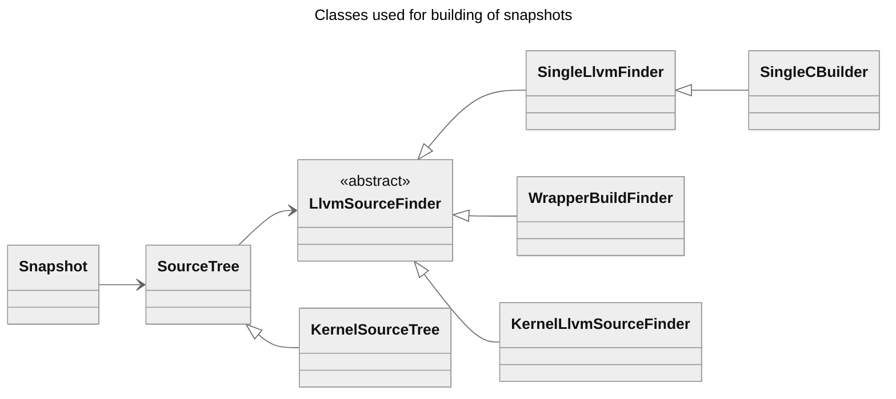
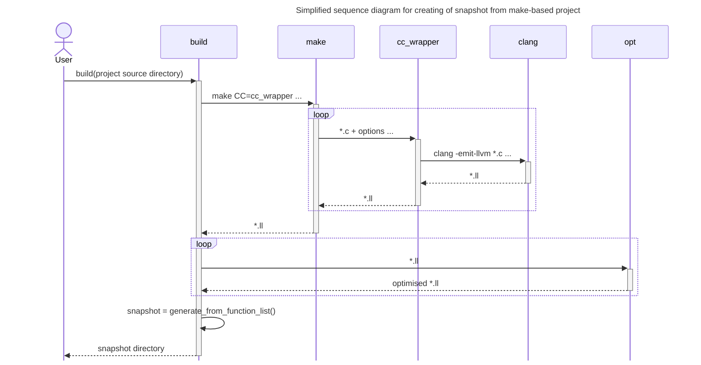
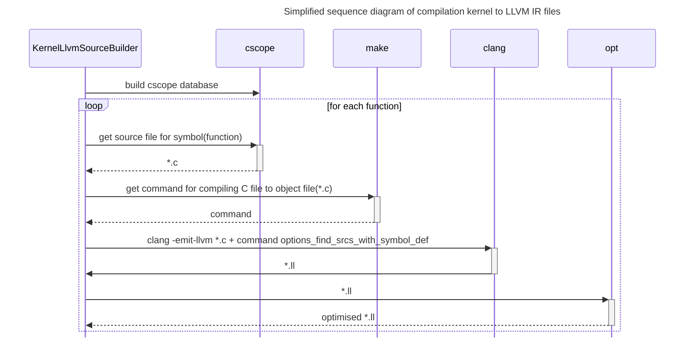

# DiffKemp architecture

DiffKemp is composed of several parts:
- **Python component** (located in the `diffkemp/` directory): Responsible for the processing of user inputs, compiling projects into snapshots, aggregating comparison results, and generating reports.
- **SimpLL** library (located in the `diffkemp/simpll/` directory): The core of DiffKemp, written in C++ for performance reason. It is responsible for the simplification and semantic comparison of two versions of project functions.
- **Result Viewer** (located in the `view/` directory): A web application, written in React and JavaScript, used for visualisation of differences found during the comparison. 

DiffKemp uses  [`CMake`](https://cmake.org/) as its build system and relies on the [LLVM project](https://llvm.org/). Specifically, it uses [LLVM IR](https://llvm.org/docs/LangRef.html) for representation and comparison of different analysed project versions.

The different parts of DiffKemp play their roles in individual phases:
1. **Snapshot generation**: The source code of analysed project is compiled into LLVM IR using the `clang` compiler.
   After compilation, optimisation passes are run (using `opt`) to simplify the LLVM IR. The compiled project is saved to a directory, which we call **snapshot**.
2. **Snapshot comparison**: Two snapshots (corresponding to different versions of the analysed project) are compared using the SimpLL library.
   - Firstly, the library for each snapshot simplifies and analyses the LLVM IR files/modules in which are located analysed symbols. This is done using the `ModuleAnalysis` class.
   - Then it uses the `DifferentialFunctionComparator` class for the comparison itself. The class extends LLVM's [`FunctionComparator`](https://llvm.org/doxygen/classllvm_1_1FunctionComparator.html) class. The `FunctionComparator` class compares functions instruction-by-instruction, DiffKemp extends it by supporting built-in semantic preserving patterns for handling more complex changes/refactorings.
   - If both the instruction-by-instruction comparison and the built-in patterns fail to detect semantic equality, and the user has provided custom *semantics-preserving patterns*, the `DifferentialFunctionComparator` also uses `CustomPatternComparator` to match changes against these patterns.
3. **Result visualisation**: The result viewer displays the source code of functions evaluated as semantically different.

## Snapshot generation

The process consists of:

  1. **Finding the necessary source files** which contains definitions of symbols specified by the user.
  2. **Compilation of the sources to LLVM IR** for which we are using `clang` compiler using `clang -S -emit-llvm ...` command which compiles the source file to human readable LLVM IR. We are also running on the LLVM IR file some optimisation passes using the `opt` utility to make the comparision easier (`dce` - dead code elimination, `simplifycfg` - simplifying control flow graph, ...).
  3. Creating a snapshot. The snapshot contains copy of necessary source files and their LLVM IR representation and metadata. The metadata are saved in `snapshot.yaml` file and it mainly contains list of the symbols specified by the user and the location of LLVM IR files in which are the symbols defined.
<!-- TODO human readable - replace -->

Implementation is divided into multiple classes:

- `LlvmSourceFinder` (`diffkemp/llvm_ir/llvm_source_finder.py`) its main purpose is to find the files containing symbols specified by the user in the `SYMBOL_LIST`. For some commands the class also handles the compilation of the necessary source files to LLVM IR.

  - For `build` command single C file is used `SingleCBuilder` which compiles the file to LLVM IR.
  - For `llvm-to-snapshot` command is used `SingleLlvmFinder` class.
  - The `build-kernel` command uses `KernelLlvmSourceBuilder` class which builds `cscope` database for the kernel to be able to easily find location of specified symbol definitions, and using the database it compiles the source files which contains the specified symbols to LLVM IR.

- `SourceTree` class (`diffkemp/llvm_ir/source_tree.py`), it is extension of `LlvmSourceFinder` and it represent the source directory/tree of the project.
- `Snapshot` class (`diffkemp/snapshot.py`) used for representing and also for saving and loading the created snapshot.

Structure of 

### `build`: snapshot generation of single C file

### `build`: snapshot generation of `make`-based projects

- TODO: mention `cc_wrapper` run python script x compiled using RPython to binary to make the compilation run faster

snapshot - structure representing one version of the program (avoids need to keep entire project source code for comparison), contains
- relevant source code files (for displaying differences in original source code)
- corresponding LLVM IR files
- index - which parts of code are relevant to each feature

SourceTree, LlvmSourceFinder - classes relevant for looking up modules relevant for a feature, finding source code and building it if needed
SourceTree - look up source files based on symbols, derived classes extend the support (KernelSourceTree - sysctl parameters, kernel modules)
LlvmSourceFinder - llvm module lookup for a symbol, finding source and building it
- `diffkemp-wdb` file

### `llvm-to-snapshot`

### `build-kernel`

-  Kernel sources are
    compiled into LLVM IR on-the-fly as necessary.
    Supports two kinds of symbol lists to generate the snapshot from:
      - list of functions (default)
      - list of sysctl options

## Snapshot comparison

- `ComparisonGraph`
- module caching

Config - specification of custom patterns, turning on and off builtin pattern, (turning on the smt solver, ...).
<!-- TODO Caching ?? -->
For each specified symbol it:

1. Checks that the symbol exists in both snapshots (project versions) and
2. Runs the semantic comparison (function `functions_diff` in `diffkemp/semdiff/function_diff.py`).
  - For the comparison it runs the SimpLL library which simplifies and compares the symbols (functions, including the called functions) and provides call graph with results of the comparison. Reruns it in case the compared function called function which definition was not located in the same LLVM IR file...
    - We differentiate non-function differences - type differences and syntax differences (macro, macro-function, function-macro). The macro-function means when the macro was changed into function or the other way around.
    - Call graphs returned for individual compared functions are aggregated into one (implemented using `ComparisonGraph` in `diffkemp/semdiff/caching.py`).
3. Creating the results: using the graph is created evaluated semanic equality of the compared function (function `graph_to_fun_pair_list` in `diffkemp/semdiff/caching.py`) - if a called function is not equal then the compared function is evaluated as non-equal. The call stacks are created from the comparison graph and the result is saved to Result` in `diffkemp/semdiff/result.py`.
4. Saves/pritns the result for non-equal compared functions
  - in individual files
  - in YAML format, contains also info about location of defintion of symbols which were compared (implemented in `YamlOutput` class - `diffkemp/output.py`).

<!-- Python interface, Simpll library, SMT Solver -->

### SimpLL

SimpLL - cpp, diffkemp uses it via Python's FFI, calling it as a seperate process
- does pre-processing passes, analyses
- removing kernel debug messages
- constructing a list of functions called from the function to be compared
- processing debug metadata for structure field accesses
(excludes cached functions)
- matches basic blocks, compared instruction by instruction,
- comparison stopped when a difference is found
- returns list of equal and differing functions, differences in macros, inline assembly

- CFFI x as binary
- output
- built-in patterns
- custom patterns
- passes

- ### SimpLL

Source files are located in `diffkemp/simpll` directory.

- CFII
- binary interface:
  located in `build/diffkemp/simpll/diffkemp-simpll` and implemented in `diffkemp/simpll/SimpLL.cpp` which provides CLI for running the library, compares the specified function between to LLVM IR files enables specifying built-in patterns, custom-patterns, ... outputs the call graph containg called function with results of their semantic comparison, missing defs, non-function objects...

- Firstly the LLVM IR files/modules are preprocessed by running transformations, which are implemented using LLVM passes, the implementation of passes is located in `diffkemp/simpll/passes` directory and it is handled from `preprocessModule` function located in `diffkemp/simpll/ModuleAnalysis.cpp`.
- Then more passes are being run in the `simplifyModulesDiff`, besides for extracting debug info which is represented by `DebugInfo` class. The debug info is used eg. in case of changes in structured types.
- Then the `ModuleComparator` class is used which recursively compares function, starting with the compared functions and continuing with called functions, it compares the functions using `DifferentialFunctionComparator`. If it evaluetes the functions as non-equal and functions which could be inlined are found, then it compares the functions again with inlined called function.
- The core of the whole SimpLL library is `DifferentialFunctionComparator` class which is based on [LLVM `FunctionComparator` class](https://llvm.org/doxygen/classllvm_1_1FunctionComparator.html).

## 3. Visualisation

  - `view` - commands, run web app created in React, which consists of components
    - `App`
      - `ResultViewer`
        - `ResultNavigation`
        - `NavigationArrows`
      - `Difference`
        - `Callstack`
        - `Code`
          - `DiffViewWrapper`
      - `FunctionListing`
