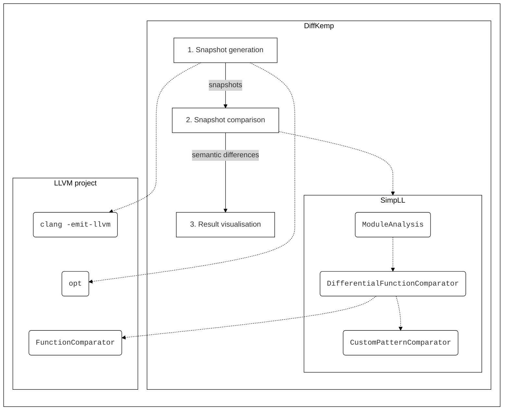

# DiffKemp architecture

DiffKemp is made up of several parts:
- **Python part** (located in `diffkemp/` directory) responsible for processing of the user inputs, compiling projects to snapshots, aggregation of comparison results and its reporting.
- the **SimpLL** library (located in `diffkemp/simpll/`): the core of DiffKemp, written in C++ for performance reasons, responsible of simplification and semantic comparison of two version of project functions, 
- **Result Viewer** (located in `view/` directory) web frontend, written using React and JavaScript, responsible for visualisation of found differences. 
The project is built upon the [LLVM project](https://llvm.org/), specifically, it uses [LLVM IR]](https://llvm.org/docs/LangRef.html) for semantic comparison of the analysed project versions.
DiffKemp uses [`CMake`](https://cmake.org/) as its build system.

The different parts of DiffKemp plays its role in individual phases:
1. **Snapshot generation** which compiles the source code of analysed project to LLVM IR using `clang` compiler.
   Then it runs optimisation passes (using `opt`) to simplify the LLVM IR. The compiled project is saved to a directory which we call **snapshot**,
   the directory also contains metadata.
2. **Snapshot comparison** compares two versions of the analaysed project that were compiled into snapshots. Uses the SimpLL library for comparison of individual functions. The library firstly simplifies the LLVM IR in `ModuleAnalysis` class and then it uses `DifferentialFunctionComparator` class for comparison. The class is build upon LLVM `FunctionComparator` class
which compares instruction by instruction and extends it with built-in semantic preserving patterns which handles little bit more difficult refactorings.
In case a custom *semantics-preserving patterns* were provided by the user, the `DifferentialFunctionComparator` also uses `CustomPaternComparator` to be able tp handle more specific refactorings/changes.
3. **Result visualisation** which visualises source codes of functions that were evaluated as semantically different.

