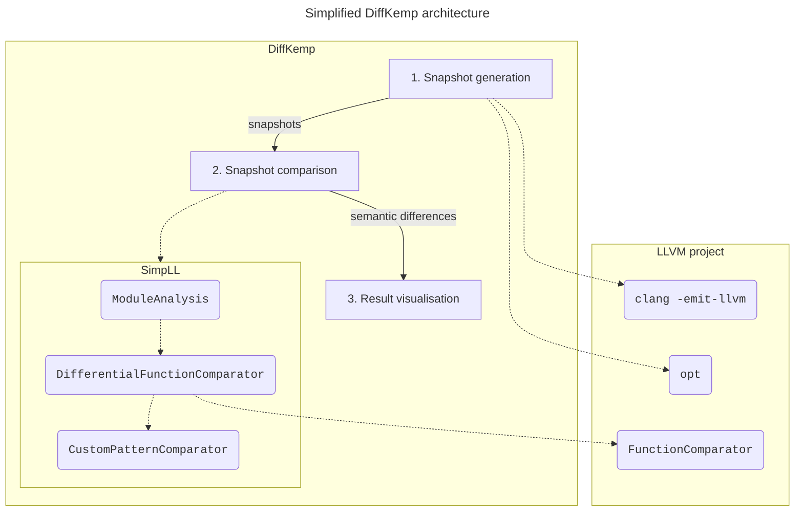
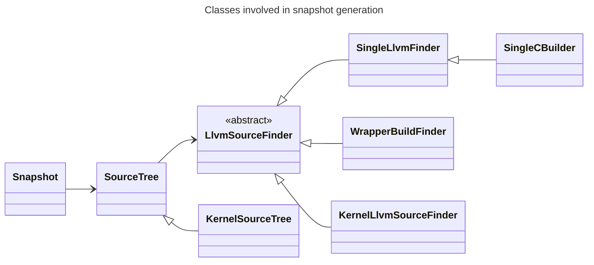
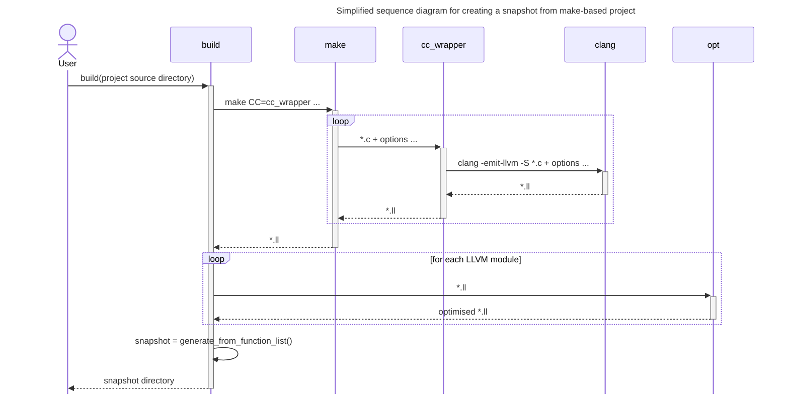
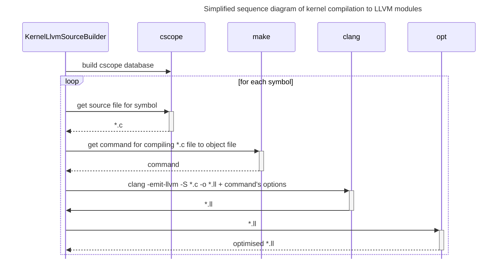
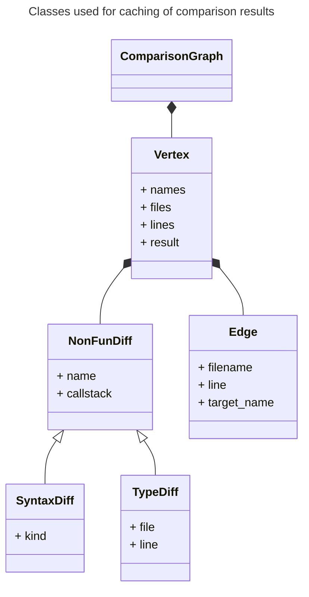
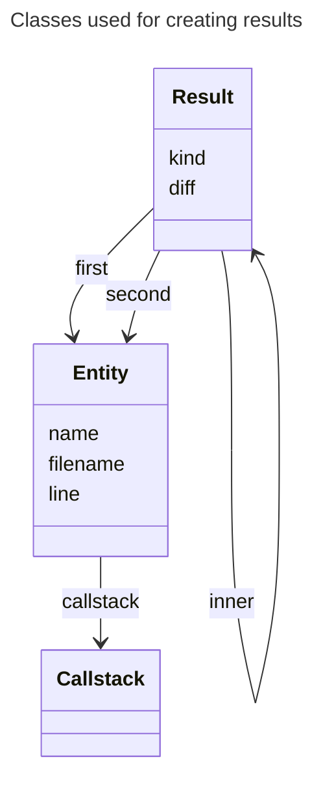
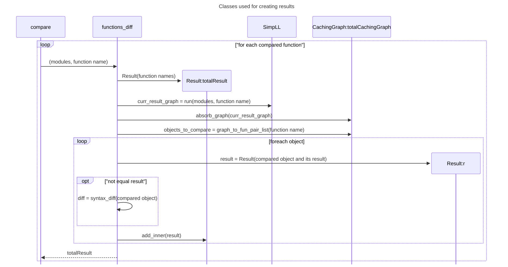
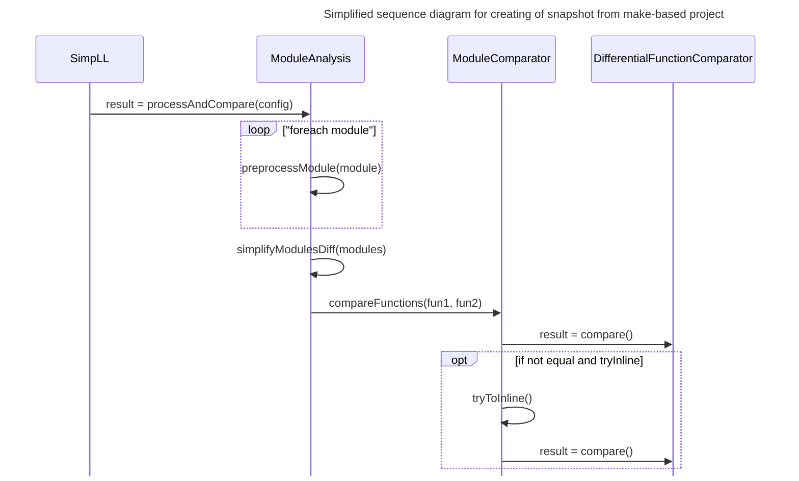
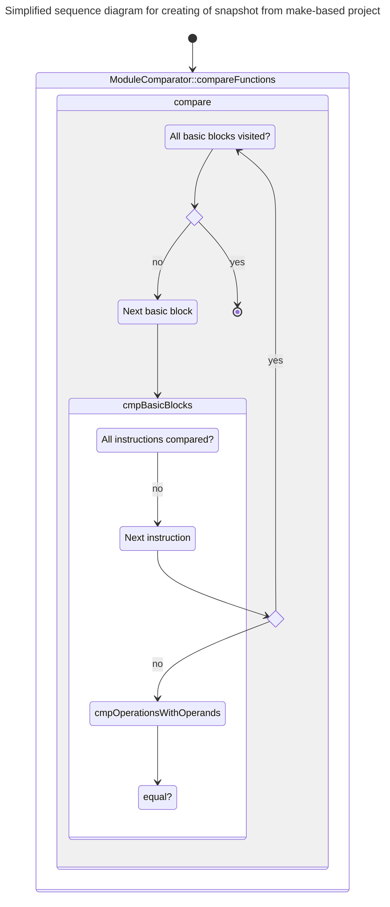
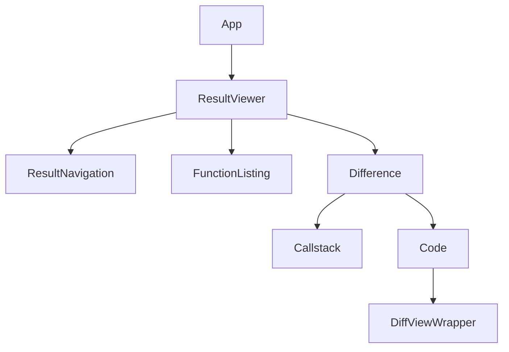

# DiffKemp architecture



DiffKemp consists of several components:
- **Python component** (located in the `diffkemp/` directory): Responsible for the processing of user inputs, compiling projects into snapshots, aggregating results of semantic comparison, and generating reports.
- **SimpLL library** (located in the `diffkemp/simpll/` directory): The core of DiffKemp, written in C++ for performance reasons. It simplifies and semantically compares two versions of the project symbols.
- **Result viewer** (located in the `view/` directory): A web application, written in React and JavaScript, used to visualise the differences found during the comparison. 

DiffKemp uses  [`CMake`](https://cmake.org/) as its build system and relies on the [LLVM project](https://llvm.org/). Specifically, it uses [LLVM intermediate representation](https://llvm.org/docs/LangRef.html) for representing and comparing different versions of the analysed projects.

## Phases of DiffKemp

DiffKemp runs in phases, in which the different parts of DiffKemp play their roles:
1. [**Snapshot generation**](#1-snapshot-generation):
   - The source code of the analysed project is compiled into LLVM IR using the [`clang`](https://clang.llvm.org/docs/ClangCommandLineReference.html) compiler.
   - After compilation, optimisation passes are run (using [`opt`](https://llvm.org/docs/CommandGuide/opt.html)) to simplify the LLVM IR.
   - The compiled project is saved to a directory, which we call a **snapshot**.
2. [**Snapshot comparison**](#2-snapshot-comparison):
   - Two snapshots (corresponding to different versions of the analysed project) are compared using the SimpLL library.
   - For each snapshot, the library simplifies (by applying multiple code transformations) and analyses the LLVM files/modules in which are located definitions of the analysed symbols. This is done using the `ModuleAnalysis` class.
   - The core comparison is handled by the `DifferentialFunctionComparator` class, which extends LLVM's [`FunctionComparator`](https://llvm.org/doxygen/classllvm_1_1FunctionComparator.html) class.
     The `FunctionComparator` class handles instruction-by-instruction comparison. DiffKemp extends this functionality by handling semantics-preserving changes (implemented as **built-in patterns**), allowing it to manage more  complex changes/refactorings.
   - Additional **(custom) patterns** can be specified manually and passed to the comparison phase. These patterns are used if both the instruction-by-instruction comparison and the built-in patterns fail to detect semantic equality. In such cases, the `DifferentialFunctionComparator` uses the `CustomPatternComparator` class to attempt to match the changes against the provided patterns.
   - The results of the comparison of individual symbols are aggregated, and the found differences are reported to the user.
3. [**Result visualisation**](#3-result-visualisation):
   - The result viewer enables the user to interactively explore the found differences (the analysed symbols that were evaluated as semantically non-equal). It shows the relation between the analysed symbols and the location causing the semantic non-equality, allowing the user to display the source code of the analysed project versions with highlighted syntactic differences that are likely causing the semantic non-equality.

## 1. Snapshot generation

The snapshot generation phase consists of the following steps:

  1. **Identifying relevant source files**:
     - Determine which parts of the project's code need to be compared. This typically means finding source files that contain definitions of the compared symbols specified by the user.
  2. **Compiling source files to LLVM IR**:
     - The identified source files are compiled into LLVM modules containing human-readable LLVM IR using the `clang` compiler with the command `clang -S -emit-llvm ...`.
     - To make the oncoming comparison easier, [several optimisation passes](https://github.com/diffkemp/diffkemp/blob/master/diffkemp/llvm_ir/optimiser.py) (`dce` - dead code elimination, `simplifycfg` - simplifying control flow graph, ...) are run on the compiled LLVM modules. The passes are run using the `opt` utility.
  3. **Creating and saving a snapshot**:
     - A snapshot, representing one version of the program prepared for comparison, is created from the compiled files and saved in the specified directory. 



Classes involved in snapshot generation:
- [`LlvmSourceFinder`](https://github.com/diffkemp/diffkemp/blob/master/diffkemp/llvm_ir/llvm_source_finder.py):
  - An abstract class with a concrete implementation based on the command used for snapshot generation.
  - It is responsible for finding LLVM modules containing specific symbol. For some commands, it also handles finding necessary project source files and their compilation to LLVM IR.
- [`SourceTree`](https://github.com/diffkemp/diffkemp/blob/master/diffkemp/llvm_ir/source_tree.py):
  - Represents the source tree of analysed project.
  - This class wraps the `LlvmSourceFinder` class and provides its functionality.
  - The derived class, [`KernelSourceTree`](https://github.com/diffkemp/diffkemp/blob/master/diffkemp/llvm_ir/kernel_source_tree.py), extends its functionality by enabling to retrieve modules containing definitions of sysctl options and kernel modules.
- [`Snapshot`](https://github.com/diffkemp/diffkemp/blob/master/diffkemp/snapshot.py)
  - Represents the snapshot, which contains:
    - Relevant source files, including those containing definitions of the compared symbols.
    - The source files compiled to LLVM IR, which are used for the actual comparison.
    - Metadata, saved in the snapshot directory as a `snapshot.yaml` file with the following structure:
      ```yaml
      # For more details, refer to the implementation
      - created_time: Date and time of snapshot creation (YYYY-MM-DD hh:mm:ss.sTZ)
        diffkemp_version: x.y.z
        list: # List of compared symbols (functions or sysctl options) and their metadata
        # In cases of function comparison, contains directly the list from the `functions` field`.
        - functions:                                                           
          - glob_var: null # Name of the global variable whose usage is analysed within the function (only for sysctl).
            name: Name of function
            llvm: Relative path to module containing the function
            tag: null # Only for sysctl, describes if the function is proc handler or uses the sysctl data variable
          # Only for sysctl
          sysctl: Sysctl option name
        list_kind: Type of comparison (function/sysctl)
        llvm_source_finder:
          kind: Used LlvmSourceFinder class
        llvm_version: XX
        source_dir: Absolute path to the project's source directory
      ```
### a) Snapshot generation of `make`-based projects (`build`)

The `build` command is used to create snapshots from `make`-based projects. The process includes the following steps:
1. The `make` command is executed on the project with [`cc_wrapper`](#cc-wrapper) used as the compiler instead of a standard compiler like `gcc`.
2. By running `make`, the project's source files are compiled to LLVM modules by the `cc_wrapper` script. 
4. After `make` completes the compilation, the resulting LLVM modules are optimised using `opt` tool.
5. The `WrapperBuildFinder` class is used to identify the LLVM modules containing definitions of symbols specified by the user.
6. A snapshot is generated from the identified LLVM modules.



#### `cc_wrapper`

The [`cc_wrapper`](https://github.com/diffkemp/diffkemp/blob/master/diffkemp/building/cc_wrapper.py) is a Python script that wraps the `gcc` compiler. If [RPython](https://rpython.readthedocs.io/en/latest/) is installed on the user's system, the `cc_wrapper` is compiled into a binary form during DiffKemp's build process using RPython. This binary form speeds up the snapshot generation process.

The `cc_wrapper` operates as follows:
- The `cc_wrapper` is invoked by `make` receiving the source file and options which would be used for compilation.
- The wrapper executes the original command using `gcc`, and additionally it compiles the C source file into LLVM module using `clang` and the received options.
- The user can optionally specify options to be added or removed when compiling the file to an LLVM module. These options are passed from the main DiffKemp script to the wrapper via system environment variables (the variables are prefixed with `DIFFKEMP_WRAPPER_`).
- The paths to the generated LLVM modules, along with flags indicating how they were created, are recorded in a file named `diffkemp-wdb`. The `f` flag indicates that the module was created by linking already compiled LLVM modules. The file format looks like this:
```
o:/abs/path/to/module.ll
f:/abs/path/to/linked_module.ll
...
```
The `diffkemp-wdb` file is later used by the `WrapperBuildFinder` to locate modules containing the specified functions, which are then included in the final snapshot.

### aa) Snapshot generation of single C file (`build`)

The `build` command can also be used to create snapshots from a single C file. It uses the [`SingleCBuilder`](https://github.com/diffkemp/diffkemp/blob/master/diffkemp/llvm_ir/single_c_builder.py) class
as the `LlvmSourceFinder`. The class also manages the compilation of the C file into an LLVM module.

### b) Snapshot generation from the Linux kernel (`build-kernel`)

The `build-kernel` command is used to create snapshots from the Linux kernel's source code. It compiles only the necessary files based on the symbols specified by the user for comparison. The snapshot can be created using a list of functions or sysctl parameters. The command uses [`KernelLlvmSourceBuilder`](https://github.com/diffkemp/diffkemp/blob/master/diffkemp/llvm_ir/kernel_llvm_source_builder.py) class as the `LlvmSourceFinder`. The process includes the following steps:

1. **Building a symbol cross-reference database** for the kernel using the [`cscope`](https://cscope.sourceforge.net/) tool. This database is then used to locate symbol definitions and usages within the kernel's source code.
2. **Indentifying necessary files for the comparison** based on the provided symbol list.
   - If a **list of functions** is provided, the C source file containing the function definition is located using `cscope` for each function.
   - In case **list of sysctl parameters** is provided, the process is slightly different:
     1. The source file containing a sysctl table describing the parameter is identified and compiled into LLVM module. 
     2. The proc handler function name (responsible for reading/writing the parameter value) and data variable (a global variable updated by the parameter) are extracted from the sysctl table.
     3. Source files containing the proc handler function and functions that interact with the data variable are identified using `cscope`.
3. The identified source **files are compiled into LLVM modules** using the following steps for each file:
   - The `make` tool is used to determine the compilation options required for the source file.
   - The source file is compiled into an LLVM module using `clang` with the discovered options. The module is then optimized using `opt` tool.
4. **A snapshot is created** from the compiled LLVM modules.



### c) Snapshot generation from a single LLVM IR file (`llvm-to-snapshot`)

The `llvm-to-snapshot` command is used to create snapshots from a single existing LLVM module. It uses the [`SingleLlvmFinder`](https://github.com/diffkemp/diffkemp/blob/master/diffkemp/llvm_ir/single_llvm_finder.py) class
as the `LlvmSourceFinder`.

## 2. Snapshot comparison

WIP

- `ComparisonGraph`
- module caching







Config - specification of custom patterns, turning on and off builtin pattern, (turning on the smt solver, ...).
<!-- TODO Caching ?? -->
For each specified symbol it:

1. Checks that the symbol exists in both snapshots (project versions) and
2. Runs the semantic comparison (function `functions_diff` in `diffkemp/semdiff/function_diff.py`).
  - For the comparison it runs the SimpLL library which simplifies and compares the symbols (functions, including the called functions) and provides call graph with results of the comparison. Reruns it in case the compared function called function which definition was not located in the same LLVM IR file...
    - We differentiate non-function differences - type differences and syntax differences (macro, macro-function, function-macro). The macro-function means when the macro was changed into function or the other way around.
    - Call graphs returned for individual compared functions are aggregated into one (implemented using `ComparisonGraph` in `diffkemp/semdiff/caching.py`).
3. Creating the results: using the graph is created evaluated semanic equality of the compared function (function `graph_to_fun_pair_list` in `diffkemp/semdiff/caching.py`) - if a called function is not equal then the compared function is evaluated as non-equal. The call stacks are created from the comparison graph and the result is saved to Result` in `diffkemp/semdiff/result.py`.
4. Saves/pritns the result for non-equal compared functions
  - in individual files
  - in YAML format, contains also info about location of defintion of symbols which were compared (implemented in `YamlOutput` class - `diffkemp/output.py`).

<!-- Python interface, Simpll library, SMT Solver -->

### SimpLL

SimpLL - cpp, diffkemp uses it via Python's FFI, calling it as a seperate process
- does pre-processing passes, analyses
- removing kernel debug messages
- constructing a list of functions called from the function to be compared
- processing debug metadata for structure field accesses
(excludes cached functions)
- matches basic blocks, compared instruction by instruction,
- comparison stopped when a difference is found
- returns list of equal and differing functions, differences in macros, inline assembly

- CFFI x as binary
- output
- built-in patterns
- custom patterns
- passes

- ### SimpLL




#### DifferentialFunctionComparator





Source files are located in `diffkemp/simpll` directory.

- CFII
- binary interface:
  located in `build/diffkemp/simpll/diffkemp-simpll` and implemented in `diffkemp/simpll/SimpLL.cpp` which provides CLI for running the library, compares the specified function between to LLVM IR files enables specifying built-in patterns, custom-patterns, ... outputs the call graph containg called function with results of their semantic comparison, missing defs, non-function objects...

- Firstly the LLVM IR files/modules are preprocessed by running transformations, which are implemented using LLVM passes, the implementation of passes is located in `diffkemp/simpll/passes` directory and it is handled from `preprocessModule` function located in `diffkemp/simpll/ModuleAnalysis.cpp`.
- Then more passes are being run in the `simplifyModulesDiff`, besides for extracting debug info which is represented by `DebugInfo` class. The debug info is used eg. in case of changes in structured types.
- Then the `ModuleComparator` class is used which recursively compares function, starting with the compared functions and continuing with called functions, it compares the functions using `DifferentialFunctionComparator`. If it evaluetes the functions as non-equal and functions which could be inlined are found, then it compares the functions again with inlined called function.
- The core of the whole SimpLL library is `DifferentialFunctionComparator` class which is based on [LLVM `FunctionComparator` class](https://llvm.org/doxygen/classllvm_1_1FunctionComparator.html).

## 3. Result visualisation



     
// - `App`
//   - `ResultViewer`: Visualisation of found semantic differences.
//     - `ResultNavigation`: Navigation between results (differences).
//       - `NavigationArrows`: Arrows for navigating in results.
//     - `FunctionListing`: Listing of compared/differing functions.
//     - `Difference`: Visualisation of selected difference
//                     (defined by compared and differing function).
//       - `Callstack`: Visualisation of call stack for the selected difference.
//       - `Code`: Preparation of code (fetching necessary files)
//                 for selected function from call stack.
//         - `DiffViewWrapper`: The visualisation of the selected function
//                              made possible by react-diff-view package.
