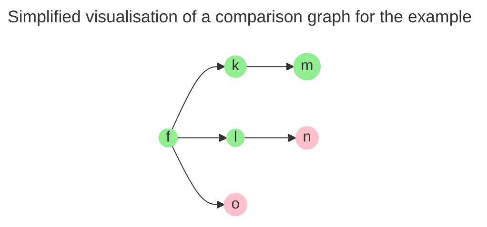
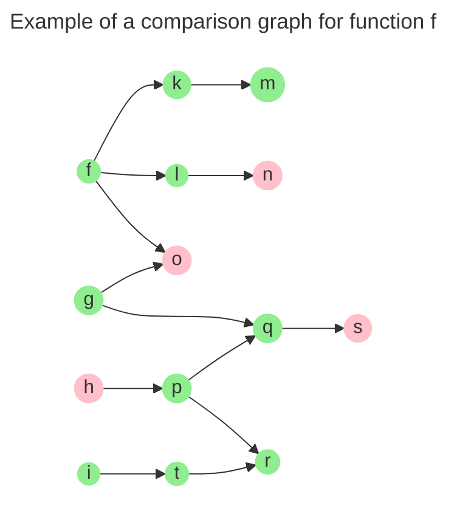
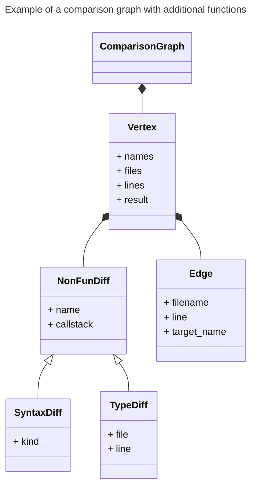

# 2. Snapshot comparison

The snapshot comparison phase is invoked using `compare` subcommand. It operates
on two snapshots generated from different versions of the project.

This phase analyses/compares specific functions based on the symbols specified
during the snapshots generation:

- **Standard symbols:** By default, functions specified during snapshot
  generation are analysed. If no symbols were provided, all functions are
  considered. Currently, non-function symbols (e.g., global variables) are not
  analysed.
- **Sysctl parameters:** When sysctl parameters are specified during snapshot
  generation, the tool compares the following for each parameter:
  - the semantics of the proc handler function,
  - all functions that interact with the data variable set by the sysctl
    parameter.
  Functions are compared with respect to the data variable, meaning only the
  portions of the functions influenced by the variable are analysed. Even if a
  function is not semantically equal in its entirety, it may still be considered
  semantically equal with respect to the variable.

The phase includes the following steps:

1. **Simplification and comparison:** Each function is simplified and
   semantically compared using the [SimpLL library](#simpll-library).
2. **Result aggregations and report creation:** The results of individual
   function comparisons are aggregated. If a function is found to be
   semantically non-equal, places where semantic differences were found are
   collected, and report is created.

## Comparison process overview

For each analyzed function, the following steps are performed:

1. **Simplification and comparison:** The function is [simplified and compared](#usage-of-the-simpll-library)
   by the [SimpLL library](./simpll.md), which uses LLVM modules containing
   the analysed function's code. The library produces a [*comparison graph*](#comparison-graph)
   with the results of the analysis.
2. **Graph absorption:** The comparison graph for the currently analysed
   function is absorbed into the graph gained from previously analysed
   functions.
3. **Identification of reachable functions:** All functions reachable from the
   analyzed function are identified in the comparison graph. This includes
   the analyzed function itself and any functions it calls.
4. **Recording non-equal results:** Reachable functions that SimpLL evaluated as
   semantically non-equal are recorded as the analysed function's
   *inner-results*. Additionally, *non-function* differences (semantic
   differences located by the SimpLL library in types, macros or inline
   assemblies) used by these functions are also recorded.
5. **Final result creation:** The final result for the analysed function is
   determined. It is marked as non-equal if any reachable function was evaluated
   as semantically non-equal. The final result also includes the
   *inner-results*.
6. **Reporting**: The final [result](#result-representation), along with details
   about the inner-results, is [reported](#comparison-report) to the user.

During the comparison process, [caching mechanisms](#caching-mechanisms) are
used to speed up the process.

## Usage of the SimpLL library

The analysis of functions is performed by the [SimpLL library](./simpll.md).
DiffKemp interacts with the library either through its CLI (command line
interface) or via [CFFI](https://cffi.readthedocs.io/en/stable/)
(C Foreign Function Interface for Python).

- **CFFI usage:** By default DiffKemp uses the SimpLL library via CFFI.
  In this case, the library is loaded as a [Python extension module](https://docs.python.org/3/extending/extending.html),
  allowing Python code to directly interact with the SimpLL library. This
  extension module is created by
  a [build script](https://github.com/diffkemp/diffkemp/blob/master/diffkemp/simpll/simpll_build.py).

  The module exposes functions for interacting with the SimpLL library,
  these function are defined in the [`FFI.cpp` file](https://github.com/diffkemp/diffkemp/blob/master/diffkemp/simpll/library/FFI.cpp).

  The CFFI is also used by snapshot generation for identification of necessary
  functions for the sysctl parameters comparison.
- **CLI usage:** If DiffKemp's `compare` subcommand is run with
  `--disable-simpll-ffi` option, DiffKemp interacts with the SimpLL library via
  its CLI. The following command is used:
  ```sh
  diffkemp-simpll OLD_MODULE NEW_MODULE --fun FUNCTION_NAME ENABLED_PATTERNS ...
  ```
  - `OLD_MODULE` refers to the LLVM module containing the old version of the
    analysed function.
  - `NEW_MODULE` refers to the LLVM module containing the new version.
  - `ENABLED_PATTERNS` refers to options for enabling individual built-in
    patterns. DiffKemp enables certain patterns by default.

  The command outputs the comparison graph to standard output.

  The SimpLL library can also be used as a standalone tool (without DiffKemp’s interface) to compare functions directly. However, using it this way is
  generally less convenient than working with DiffKemp. If using SimpLL independently, it is useful to enable the `--verbosity` option to activate
  logging, which is helpful for debugging. Additionally, unlike DiffKemp,
  SimpLL does not enable any built-in patterns by default, so they need to be manually activated to ensure better results.

## Comparison graph

The *comparison graph* contains call graphs for analysed functions, including
the analyzed functions themselves and functions they call. For each function,
the graph provides basic details like its file location and, most importantly,
the result of its semantic comparison performed by the SimpLL library. The
result is typically *equal* or *non-equal*, though there are also special cases
like *assumed-equal* or *unknown*. The comparison graph can also include
information about *non-function* differences, which refer to differences
detected within types or so called *syntax differences*. Syntax difference
represent difference found in macro, inline assembly or between function and
macro.



The diagram above is a simplified visualisation of the comparison graph that
would be outputted by the SimpLL library for the following example: function
`f` is analyzed function which calls functions `k`, `l`, `o`, `m`, and `n`
(with `m` and `n` called indirectly through `k` and `l`, respectively).
Functions `n` and `o` contain semantic differences. The comparison results are
visualised in the graph by colors, with green representing semantically equal
functions and red indicating non-equal ones.

If we analyse additional functions (`g`, `h` and `i`) with the SimpLL library
and absorb their comparison graphs by the one generated for function `f`, we
would get a more complex comparison graph, as shown below:



The comparison graph produced by the SimpLL library is represented in DiffKemp
by [`ComparisonGraph` class](https://github.com/diffkemp/diffkemp/blob/master/diffkemp/semdiff/caching.py) and other classes located in the same file:

- `ComparisonGraph` represents the overall comparison graph.
- `Vertex` contains details about individual functions, including names, file
  locations, lines where their definitions start, and semantic comparison
  results.
- `Edge` represents the relationships between called functions.
- `NonFunDiff`, `SyntaxDiff` and `TypeDiff` capture non-function differences,
  such as those found in types or macros.



## Result representation

The total results of the analyzed functions and their inner-results are
represented by the [`Result` class](https://github.com/diffkemp/diffkemp/blob/master/diffkemp/semdiff/result.py). This class aggregates instances of found semantic
differences, each including call stack that show how the location of the
difference relates to the analysed functions.

## Comparison report

DiffKemp reports the found semantic differences to a user-specified directory.
The directory contains files with the `.diff `extension representing the
analysed functions where differences were found. Each file includes detailed
information about these differences. For sysctl comparison, the `.diff`
files are organized into subdirectories for individual sysctl parameters,
which contain `.diff` files for non-equal functions analysed for that specified
parameter.

Examples of the file format can be seen in the [musl library](https://github.com/diffkemp/diffkemp/blob/master/docs/examples/musl_library.md)
and a [simple program](https://github.com/diffkemp/diffkemp/blob/master/docs/examples/simple_program.md) examples.

The directory also contains `diffkemp-out.yaml` file, which presents information
about the found differences in more structured format:

```yaml
old-snapshot: # Absolute path to the snapshot directory with the old program version
new-snapshot: # Absolute path to the snapshot directory with the new program version
results: # List of functions compared as semantically non-equal
- function: # Name of the analysed function
  diffs: # List of found differences
  - function: # Name of differing symbol (function/macro/type)
    old-callstack: # Call stack for the old program version
    - name: ... # Name of called/used symbol (function/type/macro)
      file: ... # Relative path to a file in which the symbol is called/used
      line: ... # Line on which the symbol is called/used
    - # ...
    new-callstack: # Call stack for the new program version
    - # ...
  - # ...
- # ...
definitions: # Dictionary with definition locations for previously mentioned symbols
  <name>: # Name of symbol
    kind: # Kind of symbol (function/type/macro)
    old: # Information about definition location in the old program version
      file: # Relative path to the file containing the symbol definition
      line: # Line number where the symbol definition starts
      end-line: # Line number where the symbol definition ends
    new: # Information about definition location in the new program version
      file: # ...
      line: # ...
      end-line: # ...
  # ...
```

Note: Currently, the output does not contain definition locations for macros.

## Caching mechanisms

- **Caching names of already analysed functions**: By default, when DiffKemp
  runs the SimpLL library, it caches the names of functions that have already
  been analysed. This prevents repeated analysis of functions analysed in
  previous library runs. If the library encounters a call to a cached function,
  it marks the result of the function as *unknown*. When absorbing the
  comparison graph outputted by the library, the *unknown* result is ignored,
  and the original result of the cached function is retained. The caching is
  implemented in DiffKemp by [`SimpLLCache` class](https://github.com/diffkemp/diffkemp/blob/master/diffkemp/semdiff/caching.py)
  and in SimpLL by the [`ResultsCache` class](https://github.com/diffkemp/diffkemp/blob/master/diffkemp/simpll/ResultsCache.cpp).
- **Caching parsed LLVM IR for frequently used modules**: By default, every run
  of SimpLL parses and loads LLVM IR modules containing the code of the analysed
  functions into memory. Since many analyzed functions may be located in
  a single module, DiffKemp’s `compare` sub-command offers the
  `--enable-module-cache` option to avoid unnecessary repeated parsing,
  which can slow down the comparison. Note that this caching mechanism only
  works when the SimpLL library is used through CFFI (i.e., when the `--disable-simpll-ffi` option is not used). In this case, frequently used
  modules are parsed only once and kept in memory as LLVM’s object structure,
  with pointers to it wrapped in the Python [`SimpLLModule`](https://github.com/diffkemp/diffkemp/blob/master/diffkemp/simpll/library.py)
  class. The cached parsed module is then passed to SimpLL instead of being
  re-parsed. Since SimpLL performs destructive transformations on the code, it
  is necessary to provide copy of the cached parsed module, ensuring the
  original remains untouched. A `fork` call is to implement a copy-on-write
  mechanism for the cached modules.
