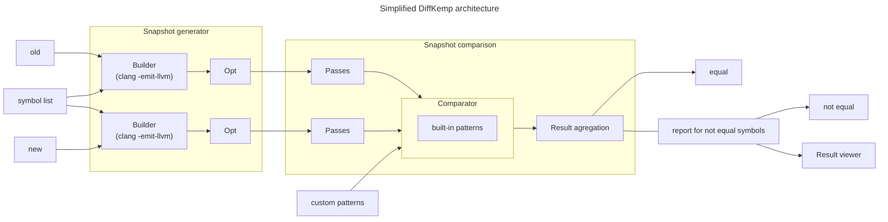

# DiffKemp architecture

DiffKemp consists of several components:
- **Python component** (located in the `diffkemp/` directory): Responsible for
  the processing of user inputs, compiling projects into snapshots, aggregating
  results of semantic comparison, and generating reports.
- **SimpLL library** (located in the `diffkemp/simpll/` directory): The core of
  DiffKemp, written in C++ for performance reasons. It simplifies and
  semantically compares two versions of the project symbols.
- **Result viewer** (located in the `view/` directory): A web application,
  written in React and JavaScript, used to visualise the differences found
  during the comparison.

DiffKemp uses  [`CMake`](https://cmake.org/) as its build system and relies on
the [LLVM project](https://llvm.org/). Specifically, it uses
[LLVM intermediate representation](https://llvm.org/docs/LangRef.html) for
representing and comparing different versions of the analysed projects.

## Phases of DiffKemp

DiffKemp runs in phases, in which the different parts of DiffKemp play their
roles:

1. [**Snapshot generation**](./generation.md):
   - The source code of the analysed project is compiled into LLVM IR using
     the [`clang`](https://clang.llvm.org/docs/ClangCommandLineReference.html)
     compiler.
   - After compilation, optimisation passes are run (using
     [`opt`](https://llvm.org/docs/CommandGuide/opt.html)) to simplify the LLVM
     IR.
   - The compiled project is saved to a directory, which we call a **snapshot**.
2. [**Snapshot comparison**](./comparison.md):
   - Two snapshots (corresponding to different versions of the analysed project)
     are compared using the SimpLL library.
   - For each snapshot, the library simplifies (by applying multiple code
     transformations) and analyses the LLVM modules in which are located
     definitions of the analysed symbols. This is done using the
     `ModuleAnalysis` class.
   - The core comparison is handled by the `DifferentialFunctionComparator`
     class, which extends LLVM's [`FunctionComparator`](https://llvm.org/doxygen/classllvm_1_1FunctionComparator.html)
     class. The `FunctionComparator` class handles instruction-by-instruction
     comparison. DiffKemp extends this functionality by handling
     semantics-preserving changes (implemented as **built-in patterns**),
     allowing it to manage more complex changes/refactorings.
   - Additional **(custom) patterns** can be specified manually and passed to
     the comparison phase. These patterns are used if both the
     instruction-by-instruction comparison and the built-in patterns fail to
     detect semantic equality. In such cases, the `DifferentialFunctionComparator`
     uses the `CustomPatternComparator` class to attempt to match the changes
     against the provided patterns.
   - The results of the comparison of individual symbols are aggregated, and
     the found differences are reported to the user.
3. [**Result visualisation**](./visualisation.md):
   - The result viewer enables the user to interactively explore the found
     differences (the analysed symbols that were evaluated as semantically
     non-equal). It shows the relation between the analysed symbols and the
     location causing the semantic non-equality, allowing the user to display
     the source code of the analysed project versions with highlighted syntactic
     differences that are likely causing the semantic non-equality.
