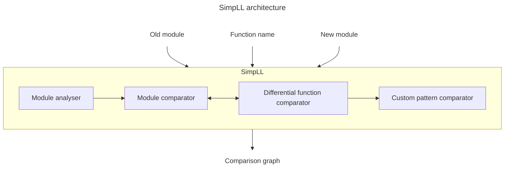

# SimpLL library

The SimpLL library is the core of DiffKemp, written in C++. It simplifies and semantically compares function in provided two LLVM modules.

- [**Module analyser**](#module-analyser) applies semantic-preserving code transformations on both modules, respectively on analysed function located in the modules. After that, it begins comparison of the function between the modules.
- [**Module comparator**](#module-comparison): Compares given function using differential function comparator and produces final result of the analysis. in case is found difference corresponding to function calls, the comparator iteratively repeats the comparison after performing function inlining
- `DifferentialFunctionComparator` extends LLVM `FunctionComparator`, compares the function using instruction-by-instruction comparison, built-in patterns and custom patterns.
- `CustomPatternComparator`

## Module Analysis

(Transformation ana analysis passes)
passes
Function passes
- `VarDependencySlicer` Slicing of program w.r.t. to the value of some global variable. Keeps only those instructions whose value or execution depends on the value of the global variable. This is only run if Var is specified. Run only in case of `sysctl` comparison when comparing functions which uses sysctl data variable. Uses forward and backward slicing for simplification of the the function CFG/
- `ControlFlowSlicer` - used when control-flow-only built-in pattern is enabled. The pass keeps only branches, function calls and all instructions that these depend on.
- `SimplifyKernelFunctionCallsPass` - used only when `kernel-prints` built-in pattern is enabled, 
- `CalledFunctionsAnalysis`: replaces/removes arguments (counter, line number, filenames) from function and inline assembly calls (printing) to be compared as equal later
- `UnifyMemcpyPass`: Uses intrinsic memcpy instruction for memcpy functions.
- DCEPass - not ours, used when dead-code pattern is enabled
- LowerExpectIntrinsicPass - not ours, removes expect instrinsic instructions
- `ReduceFunctionMetadataPass`  - removes custom function sections, unifies linkage metadata, removed tail signifier from function calls.
Module analysis
- `SeparateCallsToBitcastPass` for llvm < 15, he pass separates bitcasts from calls to bitcast operators by inserting
/// new bitcast instructions that transform function arguments and the return
/// value separately. ???
- MergeNumberedFunctionsPass - pass merges functions that differ only in name number suffix and
have the same type together into one function without the suffix.
- SimplifyKernelGlobalsPass -  Currently, the pass merges multiple globals of the same name with different
suffices into one, in case the globals contain the ".__warned" substring (these
are created by WARN_ON* macros).??
- RemoveLifetimeCallsPass - Removes `llvm.lifetime.start` and `llvm.lifetime.end` calls.
- StructHashGeneratorPass - for anonymous structs and unions (starting `union.anon`, `struct.anon`) changes name by appending hashing the type declaration. I think that this is done because we check in instructions if the names are the same. This tries to manage that names of anonymous structs are same.

simplifyModulesDiff
- `CalledFunctionAnalysis` - collects all functions potentially called (or used) by the main function or inner functions.
- `FunctionAbstractionsGenerator` - generating and unifying abstractions for indirect function calls and for inline assemblies.
- `StructureSizeAnalysis` - Set of struct sizes (including padding) and set of struct names with given size.
- `StructureDebugInfoAnalysis` - Collects all debug info nodes (DICompositeType) belonging to structure
    /// types and saves them into a map from the type names to the nodes.
- `PassInstrumentationAnalysis` - not ours
- RemoveUnusedReturnValuesPass - only if unused-return-types pass is enabled, for function which return value is not used creates clone/variant returning void and calls that function instead.
- refreshing functions
- creating DebugInfo class
- compare module comparator

## Module comparison

## Differential function comparison

FunctionComparator
- synch maps

Built-in patterns
- inlining
- relocations
- custom pattern matching
- ...

## Custom pattern comparison

Pattern matching - if a difference is found, algorithm tries to match the code starting with the first pair of instructions compared as semantically different to one of the loaded patterns, if it match a pattern, it disregards the difference

Patterns matching work on CFG matching (tries to find if a pattern graph is isomorphic to a subgraph of the program graph) and also exploits data dependencies.

- `CustomPatternComparator`
- single-side pattern comparators specialized for the specific kinds of patterns
- `InstPatternComparator`: Extends LLVM `FunctionComparator` compares individual instructions, operands, values, variables, ...
  equal instructions = match the corresponding pattern. Enhances LLVM FunctionComparator by mechanism allowing to compare functions from certain instruction (where the difference was found). It enables to skip ceratin internal instructions of basic blocks and unconditional branch instructions based on 
- `ValuePatternComparator` extends LLVM FunctionComparator, optimizes the matching of value patterns, analyses intruction operands individually and independently of the associated instruction, values can be compared directly without the need to explicitly generate instruction patterns

## Output

