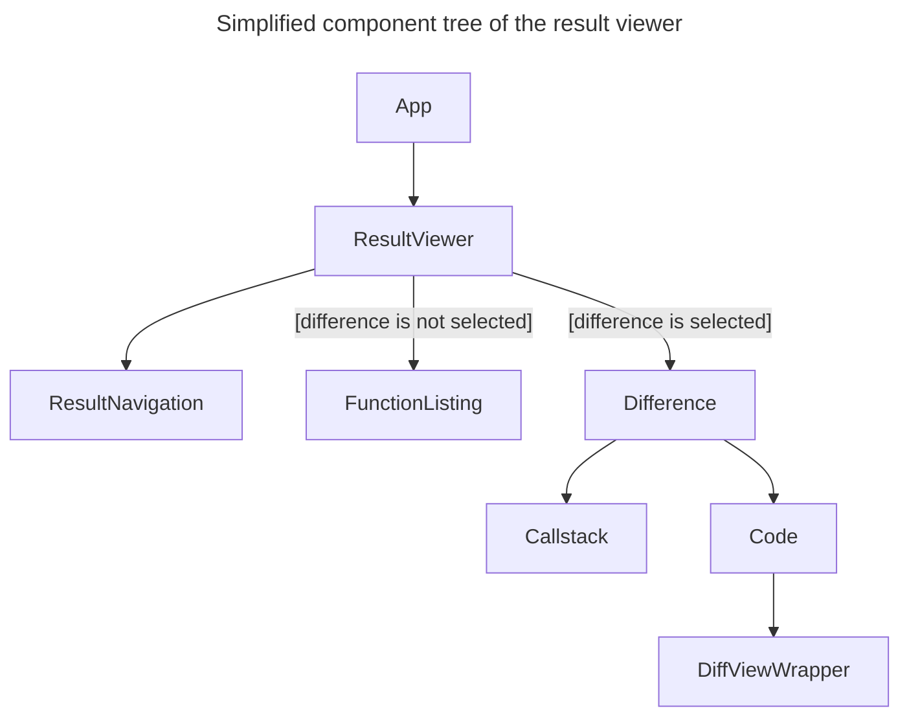

# 3. Result visualisation

The result viewer is a client-side web application developed in JavaScript using
the [React](https://react.dev/) framework and bootstrapped with
[Create React App](https://create-react-app.dev/). The application runs locally
on the user's computer using a Python HTTP server.

The application loads a file describing the results of the project's comparison
(`diffkemp-out.yaml`) and displays a list of the compared symbols evaluated to
contain semantic differences. Upon selecting a specific symbol, the application
lists places (functions, types, macros) in which semantic differences were
located. For a selected place (difference), it shows:

- Call stack containing symbols leading from the compared symbol to the symbol
  where the semantic difference was located. The call stack is interactive,
  allowing users to select a symbol. By default, the symbol with the semantic
  differences is selected.
- Source code view displaying the selected symbol's definition in both versions
  of the project source code. If the selected symbol is where the semantic
  difference was located, the syntax differences are highlighted. For other
  symbols, the usage location of the next symbol from the call stack is
  highlighted.

The application implementation is located in `/view/` subdirectory. The main
components of the application are:

- [`ResultViewer`](https://github.com/diffkemp/diffkemp/blob/master/view/src/components/ResultViewer.jsx):
  The main component that loads the comparison results and represents them using
  the [Result](https://github.com/diffkemp/diffkemp/blob/master/view/src/Result.js)
  class. It renders components for selecting functions or a visualising the
  selected difference.
- [`ResultNavigation`](https://github.com/diffkemp/diffkemp/blob/master/view/src/components/ResultNavigation.jsx):
  Informs the user about the currently shown difference and allows navigation
  between found differences.
- [`FunctionListing`](https://github.com/diffkemp/diffkemp/blob/master/view/src/components/FunctionListing.jsx):
  Rendered when no specific place with semantic difference is selected. It lists
  the compared symbols (functions) evaluated as semantically different or
  symbols/places where semantic difference were located for a selected compared
  symbol.
- [`Difference`](https://github.com/diffkemp/diffkemp/blob/master/view/src/components/Difference.jsx):
  Rendered when a difference is selected. It manages the rendering of the
  `Callstack` and `Code` components.
- [`Callstack`](https://github.com/diffkemp/diffkemp/blob/master/view/src/components/Callstack.jsx):
  Renders the call stack for the selected difference, allowing users to select a
  symbol from the call stack, which updates the displayed source code in the
  `Code` component.
- [`Code`](https://github.com/diffkemp/diffkemp/blob/master/view/src/components/Code.jsx):
  Fetches the files necessary for code visualisation. This includes source files
  with the selected symbol's definition and a diff file with syntax differences
  between versions of the symbol's definitions.
- [`DiffViewWrapper`](https://github.com/diffkemp/diffkemp/blob/master/view/src/components/DiffViewWrapper.jsx):
  Displays the source code from both project versions containing the definition
  of the selected symbol. It uses the [react-diff-view](https://github.com/otakustay/react-diff-view)
  package.

